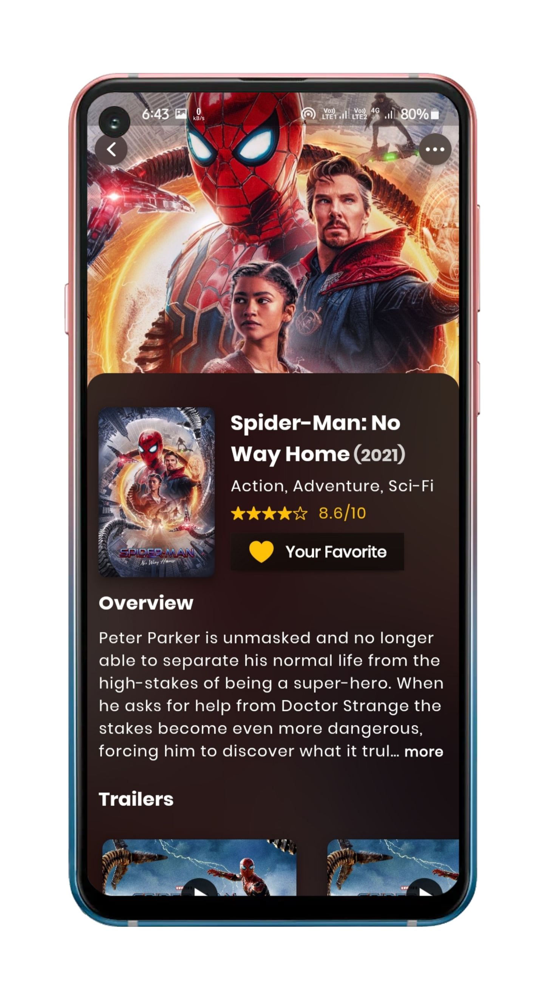
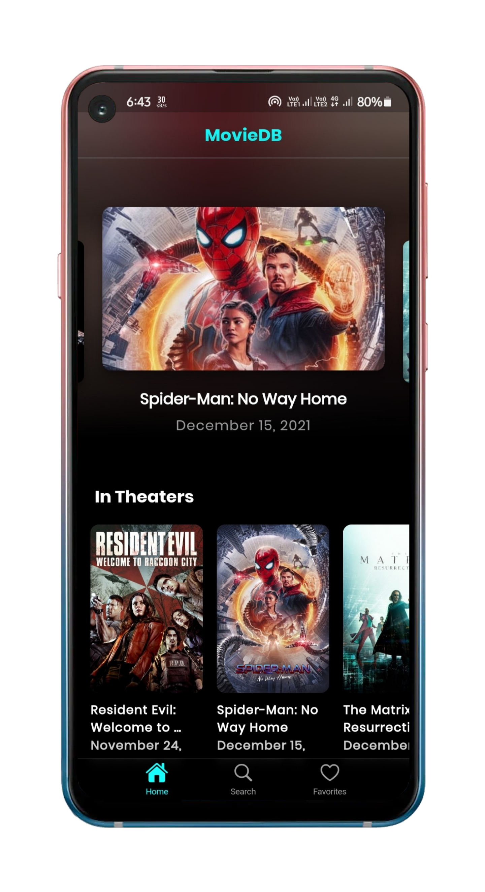
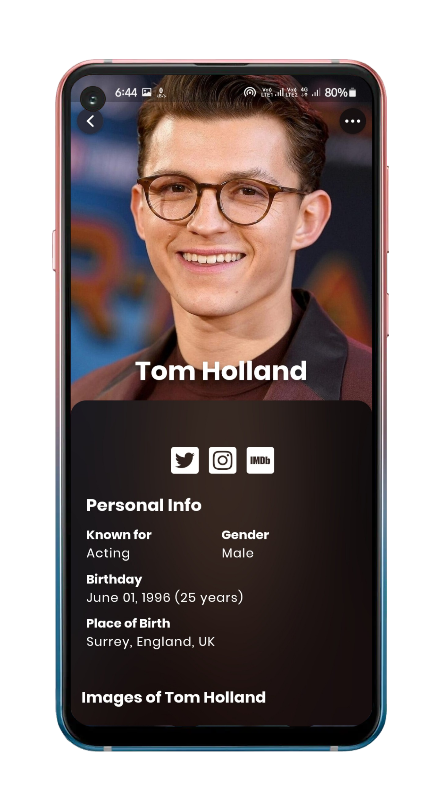
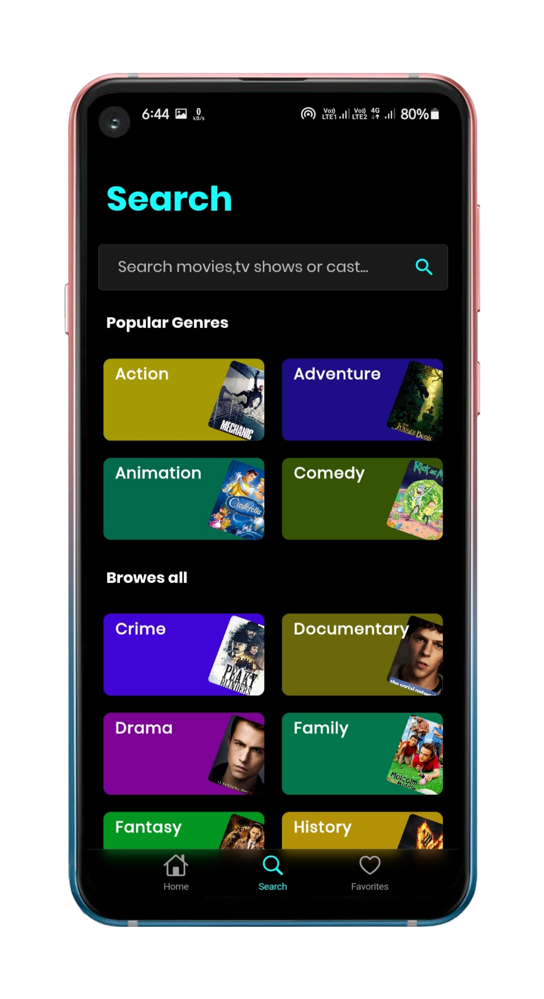
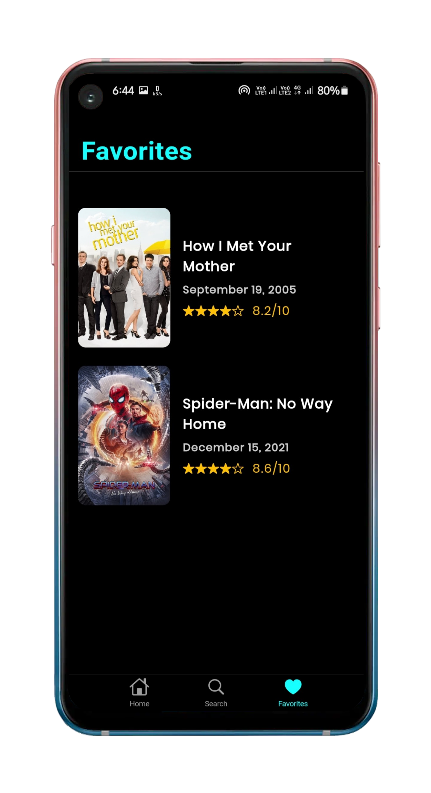
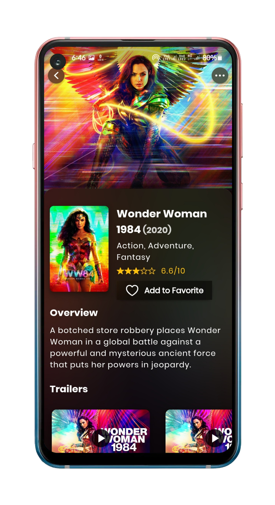
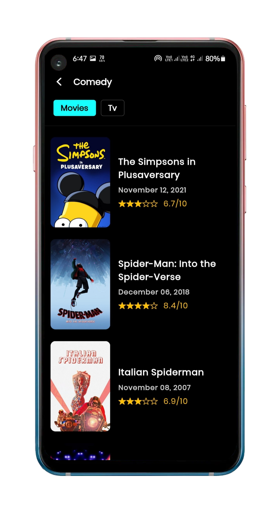
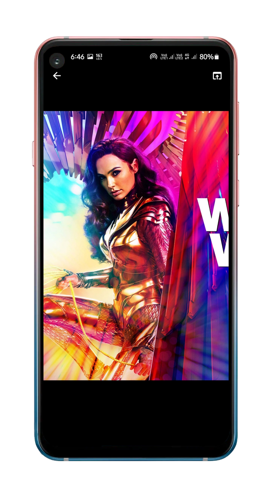
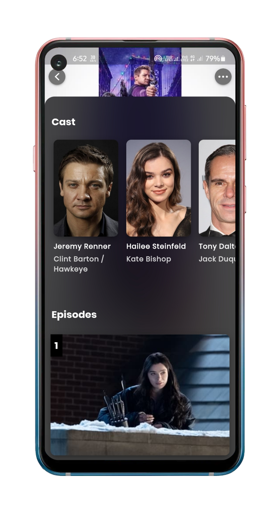

# MovieDB
Find The Latest trending and upcoming movies and tv shows with MovieDB app. The app contains all info about movies and tv shows. find similar movies or shows, Browse all genres, video trailers, backdrops, logos, and posters.

Note: App is updated to version 1.0.1 you can find other versions in release.

# Changelog

- removed cloud firestore as database.
- added hive_flutter as local database to store favorites for fast data fetching.
- added proxy server to hide Api-key and get all data in one single request(backend folder -You can deploy it to heroku).
- migrated old flutter code base (2.2.3) to latest 2.8.0 app.
- added youtube_player_flutter library to watch trailers.
- removed dynamic theming.
- added new glassy effect to each page and new theme for home page.
- added data caching for movies and tv shows.
- added image download feature. (backdrops, logos, posters)
- new animations.
- removed palette_generator package.

## App Features.

- Search Functionality
- Onboarding-Screen
- Select favourite movie
- Home Screen
- Tranding movie
- Movies different category
- Popular movie
- Upcomming movie
- Tranding person of week
- Top rated movie
- Movies detail
- Movies trailer and poster
- Movie cast
- Cast member detail
- Movies on bases of keyword
- Recommendation and similar movie

**Packages used:**

- cupertino_icons: ^1.0.2
- intl: ^0.17.0
- http: ^0.13.4
- hive_flutter: ^1.1.0
- flutter_bloc: ^8.0.0
- font_awesome_flutter: ^9.2.0
- google_fonts: ^2.1.0
- url_launcher: ^6.0.17
- readmore: ^2.1.0
- cached_network_image: ^3.2.0
- equatable: ^2.0.3
- uni_links: ^0.5.1
- shimmer: ^2.0.0
- fluttertoast: ^8.0.8
- photo_view: ^0.13.0
- carousel_slider: ^4.0.0
- youtube_player_flutter:
  - git:
  - url: https://github.com/anshrathod-blog/youtube_player_flutter

<p align="center">










</p>

## How to use

To clone and run this application, you'll need [Git](https://git-scm.com/downloads) and [Flutter](https://flutter.dev/docs/get-started/install) installed on your computer. From your command line:

```
# Clone this repository
$ git clone https://github.com/Appii00/Flutter-Bloc-MovieDB-App.git
```

```
# Go into the repository
$ cd Flutter-Bloc-MovieDB-App
```

```
# Install dependencies
$ flutter packages get
```

```
# Run the app
$ flutter run
```

This project is just for fun, but if you have any crazy idea for this app feel free to contribute, or create request for the features. Any contributions you make are greatly appreciated.

# Contact me

<a href="mailto: anshrathod29@gmail.com">

</a>
<a href="https://twitter.com/appiirathod">

</a>
<a href="https://www.linkedin.com/in/ansh-rathod-478a81210/">

</a>
