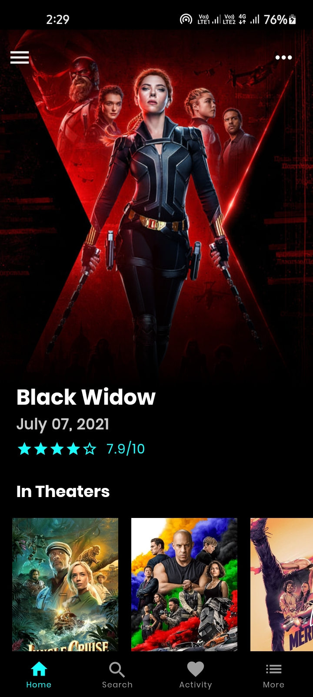
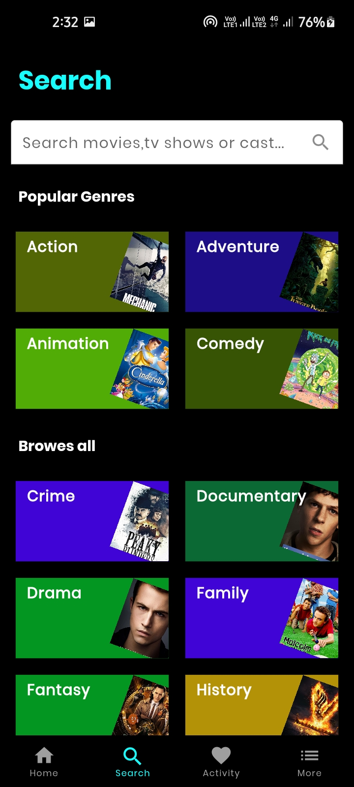
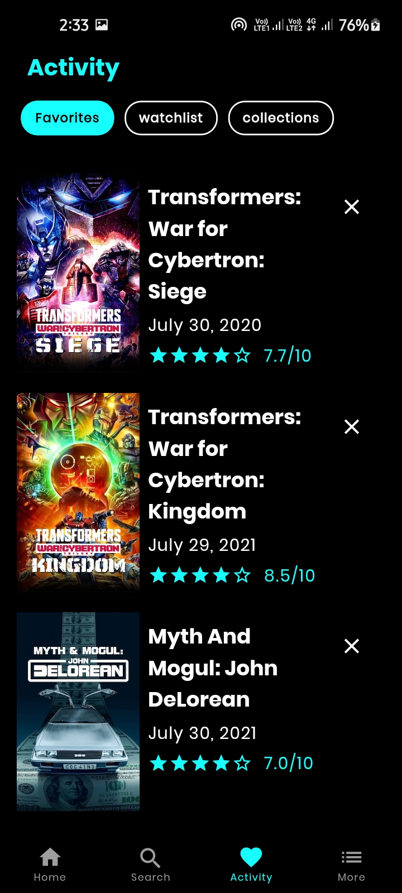
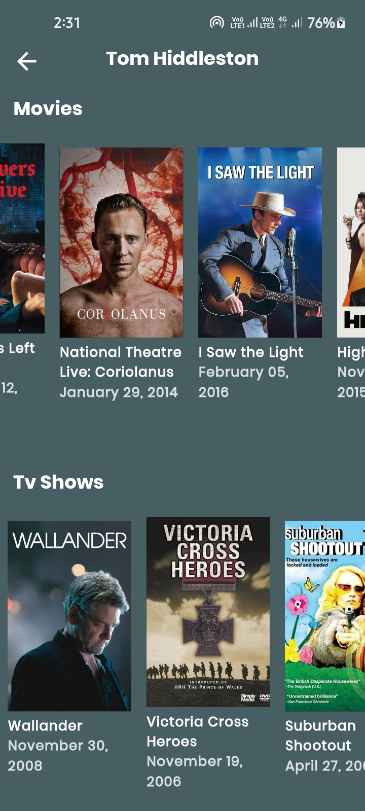
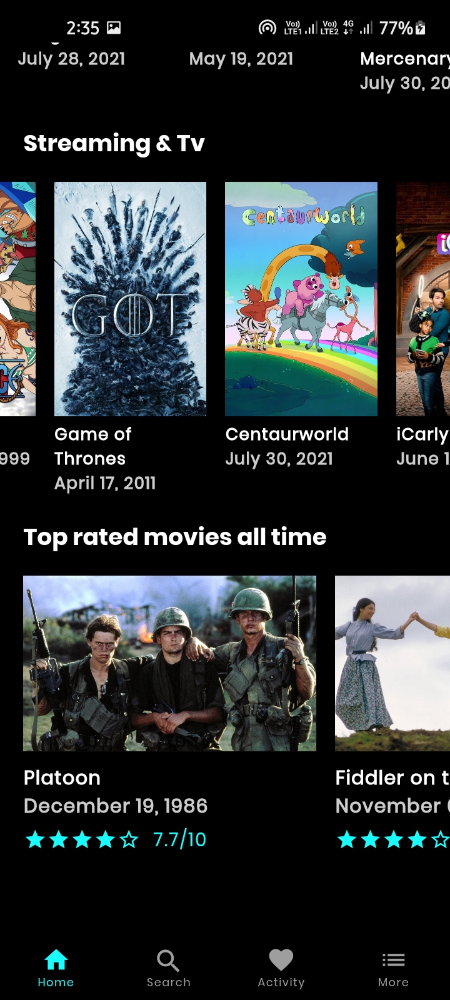

# MovieDB

## App Features.
- **Dynamic Theming**
- Search Functionality
- Onboarding-Screen
- Select favourite movie
- Home Screen
- Tranding movie
- Movies different category
- Popular movie
- Upcomming movie
- Tranding person of week
- Top rated movie
- Movies detail
- Movies trailer and poster
- Movie cast
- Cast member detail
- Movies on bases of keyword
- Recommendation and similar movie

## App Information

**Packages used:**

-  bottom_nav_bar:
 ```
   git:
      url: https://github.com/Ansh-Rathod/bottom_nav_bar
 ```
-  cached_network_image: ^3.0.0
-  cloud_firestore: ^2.4.0
-  cupertino_icons: ^1.0.2
-  decorated_icon: ^1.2.1
-  device_info: ^2.0.2
-  equatable: ^2.0.3
-  firebase_core: ^1.4.0
-  flutter_bloc: ^7.0.1
-  flutter_widget_from_html: ^0.6.1
-  fluttertoast: ^8.0.7
-  font_awesome_flutter: ^9.1.0
-  google_fonts: ^2.1.0
-  http: ^0.13.3
-  intl: ^0.17.0
-  palette_generator: ^0.3.0
-  photo_view: ^0.11.1
-  readmore: ^2.1.0
-  shimmer: ^2.0.0
-  url_launcher: ^6.0.9


<p align="center">










</p>

## How to use

To clone and run this application, you'll need [Git](https://git-scm.com/downloads) and [Flutter](https://flutter.dev/docs/get-started/install) installed on your computer. From your command line:

```
# Clone this repository
$ git clone https://github.com/Appii00/Flutter-Bloc-MovieDB-App.git

# Go into the repository
$ cd Flutter-Bloc-MovieDB-App

# Install dependencies
$ flutter packages get

# Run the app
$ flutter run
```
